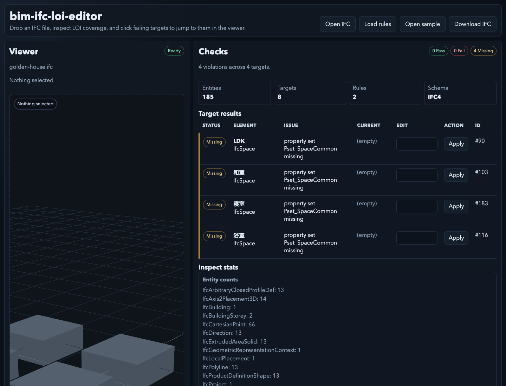

# bim-ifc-loi-editor

IFC の LOI (Level of Information) をブラウザだけで検査・編集する実験用デモです。

このリポジトリは、フロントエンドだけで IFC LOI の検査・編集フローを検証するためのものです。本番用の BIM オーサリングツールではありません。

IFC STEP ファイルをブラウザで読み込み、ルールに基づく LOI チェックを実行し、警告一覧を表形式で編集できます。選択中の対象は簡易 3D ビューで強調表示され、編集後の IFC はブラウザからダウンロードできます。

デモ:

```text
https://bim-ifc-loi-editor.0xkaz.com
```



## 主な機能

- IFC ファイルをファイル選択、ドラッグ&ドロップ、または同梱サンプルから読み込み
- 同梱ルールまたは任意の JSON ルールファイルを読み込み
- IFC のエンティティ数、プロパティセット、単位、チェック結果を表示
- `Target results` の表から不足・不適合項目を直接編集
- 編集中の対象をビューア上でハイライト
- 編集済み IFC をブラウザからダウンロード
- 依存関係のインストール後は実行時ネットワーク不要

## 技術構成

- Vite
- TypeScript
- Vitest
- Three.js

現時点では Rust、WebAssembly、`web-ifc`、`@thatopen/components` は使っていません。ビューアは Three.js による簡易表示で、完全な IFC ジオメトリレンダリングではありません。LOI のパーサと検査ロジックは、ビューアから独立した TypeScript モジュールです。

## 起動方法

推奨環境:

- Node.js 22 以上
- pnpm

依存関係をインストールします。

```bash
pnpm install
```

開発サーバーを起動します。

```bash
pnpm dev
```

ターミナルに表示される Vite の URL を開き、**Open sample** または IFC ファイルのドラッグ&ドロップで読み込みます。

## ビルドとテスト

```bash
pnpm test
pnpm build
```

本番ビルドは `dist/` に出力されます。

## IFC の編集とダウンロード

1. IFC ファイルを読み込みます。
2. `Target results` の表で警告を確認します。
3. `Edit` 列に値を入力します。
4. 対象行の `Apply` をクリックします。
5. `Download IFC` をクリックします。

ダウンロードされる IFC には、表で適用した編集内容が反映されます。

## ルールファイル

デフォルトのルールファイルは次の場所にあります。

```text
rules/space-basic.json
```

**Load rules** から任意の JSON ルールファイルも読み込めます。ルール検査はビューアと独立しているため、3D 表示が使えない場合でも LOI 検査は動作します。

## サンプルファイル

同梱サンプル IFC は次の場所にあります。

```text
fixtures/golden-house.ifc
```

ローカルデモとテスト用の入力ファイルです。

## 既知の制限

- 実験用デモリポジトリです。
- 3D ビューは対象選択を分かりやすくするための簡易表示です。完全な IFC ジオメトリレンダリングではありません。
- IFC 対応範囲は STEP テキストの解析と LOI 向けの属性・プロパティ編集が中心です。
- 編集は対応済みの属性と `IfcPropertySingleValue` 系のルール対象に適用されます。
- 編集後の IFC を本番利用する場合は、専用の BIM/IFC ツールで別途検証してください。

## Cloudflare Pages

Cloudflare Pages では次の設定を使います。

- Build command: `pnpm build`
- Build output directory: `dist`
- Root directory: repository root

実行時の環境変数は不要です。

## 公開前の注意

`node_modules/`、`.pnpm-store/`、`dist/` などの生成物やローカルキャッシュは公開リポジトリに含めないでください。

## ライセンス

Apache-2.0 です。詳細は `LICENSE` を参照してください。
